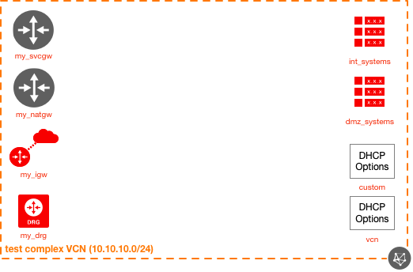

# OCI Network Module Example (Complex/Parameterized)

## Introduction

| Complexity |
|---|
| Complex |

This example shows how to utilize the core-network module, changing more resource parameters, as well as using parameterized inputs (using variables as inputs to the module instantiation). This example uses a combination of `terrafrom.tfvars`  and `basic_network.auto.tfvars`. Here are all of the resources created in this example:

* 1x VCN
* 1x IGW
* 1x SVCGW
* 1x NATGW
* 1x DRG
* 2x Route Tables
* 2x DHCP Options

Functionally, the output is the same as the simple example, however it's achieved in a different way (using parameterized inputs) as well as customized slightly (resource names, etc).

This example defines the routing policies and DNS profiles that will be used throughout a fictitious OCI environment. Though this is just an example, it is common to find only a couple of unique policies, thus why this example showcases this.

## Topology Diagram
This example is intended to the following OCI topology:



## Using this example
Prepare one variable file named `terraform.tfvars` with the required information (or feel free to copy the contents from `terraform.tfvars.template`). The contents of `terraform.tfvars` should look something like the following:

```
tenancy_ocid = "ocid1.tenancy.oc1..xxxxxxxxxxxxxxxxxxxxxxxxxxxxxxxxxxxxxxxxxxxxxxxxxxxxxxxxxxxx"
user_ocid = "ocid1.user.oc1..xxxxxxxxxxxxxxxxxxxxxxxxxxxxxxxxxxxxxxxxxxxxxxxxxxxxxxxxxxxx"
fingerprint= "xx:xx:xx:xx:xx:xx:xx:xx:xx:xx:xx:xx:xx:xx:xx:xx"
private_key_path = "~/.oci/oci_api_key.pem"
region = "us-phoenix-1"
default_compartment_ocid = "ocid1.compartment.oc1..xxxxxxxxxxxxxxxxxxxxxxxxxxxxxxxxxxxxxxxxxxxxxxxxxxxxxxxxxxxx"
```

Then apply the example using the following commands:

```
$ terraform init
$ terraform plan
$ terraform apply
```
